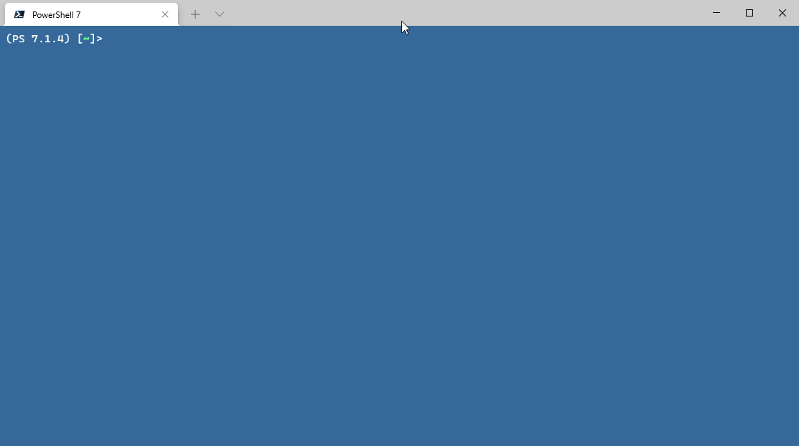

# Random password generator for PowerShell

Ever wanted to make a _truly random*_ password in PowerShell? Well you can now. This is just a really spur of the moment side-project I started working on, because the static class `System.Web.Security.Membership`, which has the method `GeneratePassword(int length, int numberOfNonAlphanumericCharacters)`, is only available in .NET 2.0 through 4.8 and the `System.Random` class [isn't a secure way of randomly generating numbers](https://docs.microsoft.com/en-us/dotnet/fundamentals/code-analysis/quality-rules/ca5394) (Though it might gain [_some_ security improvements in .NET 6.0](https://github.com/dotnet/runtime/blob/v6.0.0-preview.7.21377.19/src/libraries/System.Private.CoreLib/src/System/Random.cs#L218), but it's still a pseudo-random number generator). This random password generator should be compatible across all supported platforms for PowerShell 7.1, which I go into more detail in [this section](#under-the-hood).

_**\*** Random enough._

## Requirements

### Building

* **.NET SDK** - Minimum of `5.0`.

### Running

* **PowerShell** - Minimum of `7.1`.
  * **Note**: That's all I've tested it on and PowerShell 7.1 is based off of .NET 5, which is the target framework for compiling this.

## How it works

Right now it goes through these steps to generate a random password:

1. Randomly decide if an individual character should be an Alpha (`A-Za-z`), Number (`0-9`), or Symbol (`@`, `#`, `!`, etc.) character.
2. Randomly select a character from their respective character type.
   - If the character randomly chosen is in the `-IgnoredCharacters` parameter, it will rerun that step.
3. Merge all of the characters into a string and return it to the console.
4. **???**
5. Profit!

### Under the hood

It utilizes the `System.Security.Cryptography` class `RandomNumberGenerator` to cryptographically choose the characters. .NET will choose how it randomly generates numbers depending on your platform:

* **Windows** will use the [`BCryptGenRandom()`](https://docs.microsoft.com/en-us/windows/win32/api/bcrypt/nf-bcrypt-bcryptgenrandom) function in the win32 API header `bcrypt.h`, which will default to what the system preferred algorithm is based off of your hardware.
  * **Sources**:
    * [`@dotnet/runtime/src/libraries/System.Security.Cryptography.Algorithms/src/Internal/Cryptography/RandomNumberGeneratorImplementation.Windows.cs`](https://github.com/dotnet/runtime/blob/v5.0.9/src/libraries/System.Security.Cryptography.Algorithms/src/Internal/Cryptography/RandomNumberGeneratorImplementation.Windows.cs#L14) (As of .NET 5.0.9)
* **macOS** will use, what I believe (Correct me if I'm wrong), the [`SecRandomCopyBytes()`](https://developer.apple.com/documentation/security/1399291-secrandomcopybytes) function found in the [Apple Security Framework](https://developer.apple.com/documentation/Security).
  * **Sources**:
    * [`@dotnet/runtime/src/libraries/System.Security.Cryptography.Algorithms/src/Internal/Cryptography/RandomNumberGeneratorImplementation.OSX.cs`](https://github.com/dotnet/runtime/blob/v5.0.9/src/libraries/System.Security.Cryptography.Algorithms/src/Internal/Cryptography/RandomNumberGeneratorImplementation.OSX.cs#L14) (As of .NET 5.0.9)
    * [.NET Core 2.0 Announcement that macOS will use the Apple Security Framework](https://github.com/dotnet/announcements/issues/21)
* **Unix-based systems** will use, what I believe (Correct me if I'm wrong), the OpenSSL library for cryptographic operations and should be using the [`RAND_bytes()`](https://www.openssl.org/docs/manmaster/man3/RAND_bytes.html) function. OpenSSL should default to whatever entropy sources your OS and system supports.
  * **Sources**:
    * [`@dotnet/runtime/src/libraries/Common/src/Interop/Unix/System.Native/Interop.GetRandomBytes.cs`](https://github.com/dotnet/runtime/blob/208e377a5329ad6eb1db5e5fb9d4590fa50beadd/src/libraries/Common/src/Interop/Unix/System.Native/Interop.GetRandomBytes.cs#L17) (As of .NET 5.0.9)
    * [`@dotnet/runtime/src/libraries/Common/src/Interop/Unix/Interop.Libraries.cs`](https://github.com/dotnet/runtime/blob/208e377a5329ad6eb1db5e5fb9d4590fa50beadd/src/libraries/Common/src/Interop/Unix/Interop.Libraries.cs#L11) (As of .NET 5.0.9)